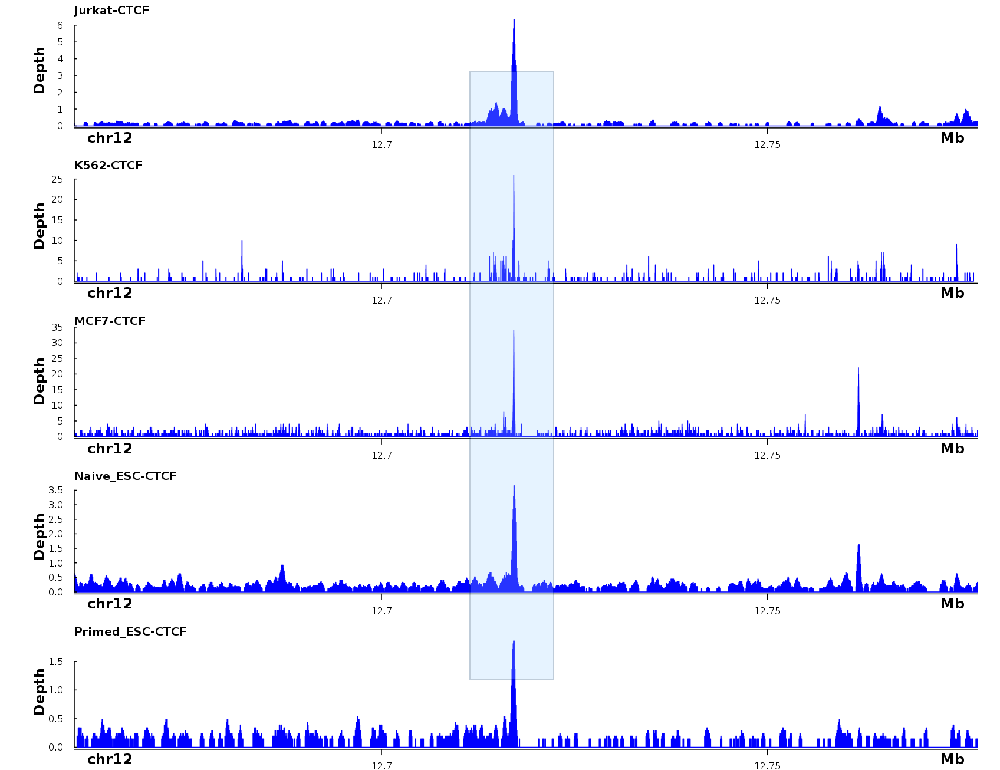
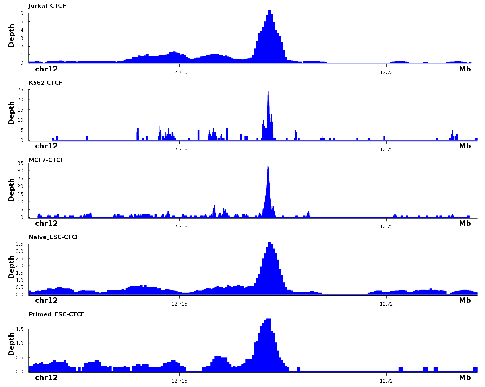
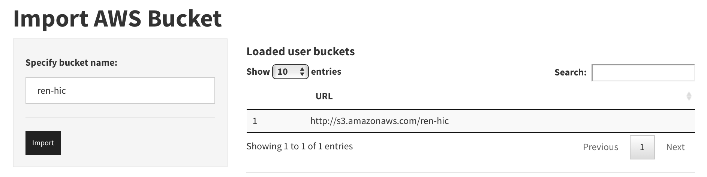

<a name="GUIDE"></a>
# **DNAlandscapeR Guide**
**N.B.** All hyperlinks will either redirect to a location inside this document or open a new tab/browser window. Thus, clicking on any link will not exit your current session. 
<br><br>
#### **Contents:**
* [Basic User Guide](#bug)
* [First Time User](#let)
* [Advanced plotting options](#apo)
* [ChIA-PET Tracks Configuration](chiapetConfig)
* [Hi-C Tracks Configuration](#hicConfig)
* [Interactive zooming](#iz)
* [Advanced Downloading](#advDL)
* [Visualizing User Data](#uld)
* [Linking an S3 Bucket](#bucket)
* [Creating .rds for ChIA-PET Visualization](#crL)
* [Creating .rds for Hi-C Visualization](#hic)
* [FAQ](#faq)
<hr>

<a name="bug"></a>
### **Basic User Guide**
The browser for **DNAlandscapeR** is housed on the "Visualize" tab. The side panel contains the basic functionality for the selecting displayed tracks, choosing a region to be displayed, and navigating a DNA landscape. Under "Select Tracks", the user can specify which tracks and in what order they will be stacked on the plot. We note that this window is searchable, meaning a user can start to type "CTCF" and the selection field will be narrowed to only tracks with "CTCF" in the name description. 

After selecting tracks, the genomic coordinates can be specified for the region of interest either through directly specifying the region or through plotting a valid gene name. Currently, we support all autosomal chromosomes in addition to chromosome X. By default, the human genome is displayed, but we also support the mouse genome (see advanced options). 

Other buttoms below the "Plot Region" option behave intuitively. These options allow the user to zoom in and out, shift left and right, and wipe the environment before reselecting options to plot. Check out the [interactive zooming](#iz) guide to more easily specify a zoomed in region of interest. 

While **DNAlandscapeR** has a considerable repository of data, it lacks much of the functional annotation available in the [UCSC Genome Browser](https://genome.ucsc.edu/). To facilitate a more integrative user experience, the region currently displayed in the **DNAlandscapeR** will be opened in the UCSC Browser when selecting the UCSC button.  

By selecting the "Download Quick Plot" button, a 8.5 x 11 inch PDF of the currently displayed landscape will save locally. To render publication-quality images of the currently displayed landscape, see the [advanced downloading](#advDL) section.
<hr>


<a name="let"></a>
### **First Time User**
The first use of a new genome browser can be overwhelming. In an effort to get new users exploration started, one can simply press the "Load Example Tracks" button at the bottom of the side panel. This will initialize four sample tracks into the Selected Tracks, including 3 topology data. To visualize the default region, simply press "Plot Region" to view the loaded tracks. A user can then zoom, shift, download, and add additional tracks with ease. Note that the "Human" genome must be selected for tracks to load. If the "Mouse" genome build is specified, no new data will load. The pre-loaded data will enable the viewing of the three-dimensional loops that span the CTCF peaks, which can be viewed underneath from ChIA-PET data, in the GM12878 cell line. We can view the overall three-dimensional structure from a Hi-C experiment, and compare the topological domains in the GM12878 cell line with those in the IMR90 cell line. Overall, this sample plot shows some of the variability in the three-dimensional structure of the two cell lines, confirms correspondence of Hi-C topological domains and ChIA-PET loops, and verifies that loop anchors correspond to regions of CTCF binding.
<hr>

<a name="apo"></a>
### **Advanced plotting options**
The collapsible panel labeled **Advanced Options** includes the following features:
* **Organism selection--** Allows for the toggling back and forth between the landscape of mouse and human. 
* **Genome Annotation--** This drop-down box supports a basic gene body annotation as well as more advanced track. In the default gene bodies track, only protein-coding genes whose entire transcription body is present in the specified region will be displayed. The second track, "Detailed Gene Annotation", displays exon-level resolution of gene bodies that are not necessarily protein coding genes. Additionally, genes only partially present in the region are displayed. While the "Detailed Gene Annotation" track is often more useful for small regions displayed in the browser, we note that displaying large regions with this option selected can dramatically slow the browser down. We recommend looking at the Detailed Annotation in regions less than 100kb. 
* **Log Transform Continuous Tracks--** When this box is checked, the scores associated with epigenetic peaks will be log<sub>2</sub> transformed. This only applies to ReadDepth tracks (e.g. RNA-Seq, DNase, ChIP-Seq, etc.) and does not necessarily apply to methylation.
* **Configure Visualization--** These set of boxes and the button behave the same way as the previous "Plot Region" command with genome coordinates but provides a different basis for entering these coordiates. 
* **Track Customization--** Two drop down boxes that allow users to flip displayed tracks or add/remove the displayed genome coordinates on the x-axis. These lists are dynamic in that only the selected tracks are rendered as choices to be flipped or annotated.
<hr>

<a name="iz"></a>
### **Interactive Zooming**
As the **Zoom In** button increases the focuses in on the center part of the currently displayed, we describe how users can zoom on any region currently displayed. For example, consider the landscape of CTCF in 5 cell lines shown below. If a user is interested in further characterizing a particular peak, simply drag the mouse over the region of interest and define a shaded box. <br><br>

<br><br>
After selecting a region, one can simply double click anywhere on the plot to zoom over the specified region. The boundaries of the shaded box will define the new x-coordinates in the updated plot. The y-coordinates of the box do not have an effect on the ensuing zoom. The plot below shows the shaded region after being double-clicked.
<br><br><br>
<br><br>
<hr>

<a name="chiapetConfig"></a>
### **ChIA-PET Tracks Configuration**
* **Individual Sample PET Cutoff-** An input option to specify the minimum number of PETs (reads supporting the interaction) in each sample appears dynamically as the user specifies the number of ChIA-PET samples. As the sequencing depth between these tracks is highly variable, we suggest to use this feature to determine the most confident loops within each sample but 
* **Color Loops Based on Biological Annotation-** If available, when this button is selected, the ChIA-PET loops will be colored based on proximity to various epigenetic and genetic features, such as enhancers and promoters. The [FAQ](#faq) discusses this annotation process and color meaning in greater detail. When the box is not selected, all loops will appear black.  
* **Show Single Anchors in ChIA-PET Tracks-** **DNAlandscapeR** only plots loops that have both anchors in the specified region. When this option is selected, small green bumps will be displayed in areas where one side of a loop anchors in the region. Users should then consider zooming out to see the full loop. 
* **ChIA-PET Loop Width Normalization--** The width of each loop indicates how many reads support the interaction relative to all displayed samples ("Between Track") or relative to itself ("Within Track"). A user can choose "None" to have consistent loop widths across all samples.
<hr>

<a name="hicConfig"></a>
### **Hi-C Tracks Configuration**
The third collapsible panel provides custom options for tracks of Hi-C data. On the left column, users can choose between the different resolutions available per sample selected. These dynamically appear as the user specifies one or more Hi-C tracks. By default, the best resolution for each sample will appear.<br><br> Additionally, Users can select displaying the heatmap legend across the different plots and specifying the max/min color values. If the Max/Min button is selected, all values above the max will be plotted with the highest intensity color while all the values below the min will be plotted with the lowest intensity color. If the Quantile Thresholds is selected, all values over the max quantile (as a percentage) will be potted with the highest intensity color and similarly for the minumum. However, values along the diagonal (where there isn't an interaction but self-mapped reads) are removed. <br><br>In the final column, users can specify the color theme associated with the Hi-C visualization as well as the missing data color. By default, the missing data regions are displayed as the minimum interaction color for the plot. Finally, the option to log<sub>2</sub> transform the Hi-C matrix values is afforded. 
<hr>

<a name="advDL"></a>
### **Advanced Downloading**
Within the Advanced Downloading panel, we provide inputs to configure high resolution plots of the currently displayed landscape and to download the source data behind each of the plots. To render a high-quality image, **DNAlandscapeR** passes user input directly into the <a href="https://stat.ethz.ch/R-manual/R-devel/library/grDevices/html/dev2bitmap.html" target="_blank">bitmap</a> function, which include the file format, resolution, and image size. 

Additionally, we provide two different types of data download. The first produces a tab separated file specifying the characteristics of all the displayed loops. The second renders a list of data frames in a R binary data format that can be easily parsed using the `readRDS` function. 

<hr>

<a name="uld"></a>
### **Visualizing User Local Data**
While our browser provides a wide variety of epigenetic data for both mouse and human, users may wish to include their own data to visualize in the browser. **DNAlandscapeR** accepts the common data file formats (BedGraph, BigWig) for visualizing methylation, ChIP-Seq, RNA-Seq, and other quantiative regional data in addition to new data formats for ChIA-PET and Hi-C that we discuss [below](#crL) how to generate. The **Import** tab contains the following input parameters to add local data to **DNAlandscapeR**:
* Specify organism-- Choose which genome build (human/mouse) to visualize the new data alongside.
* Add file-- Choose the local file to be uploaded to **DNAlandscapeR**. The selected file will not be imported into the browser until later input options are specified and the **Add** button is pressed. 
* Specify track name-- The text entry will define the name of the added track both in the plotting and in the dropdown selection.
* Data type-- Identify the file type (we do not infer the type from upload). ChIP-Seq, RNA-Seq, and other quantiative regional data should be specified as ReadDepth.
* **Add**-- The local file will hosted in browser alongside the other pre-loaded datasets. A user can confirm the configuration of the local addition in the data frame listed on the main panel of the page. 

<hr>

<a name="bucket"></a>
### **Linking an S3 Bucket**
For users that have several tracks that they would like to display in our browser, we support linking unique Amazon S3 Buckets that match the data hierarchy that we use in our bucket.The basic data hierarchy is shown below:
```
/data/
    human/
        hic/
            sample/
                sample_resolution/
        loops/
        methylation/
        tracks/
    mouse/
       hic/
            sample/
                sample_resolution/
        loops/
        methylation/
        tracks/
```
For the Hi-C data tracks, the file name must follow the following format: sample_resolution-chr\*.rds. Otherwise, other samples can be named however as long as they are properly organized within the folder hierarchy. The S3 bucket for **DNAlandscapeR** is <a href="http://s3.amazonaws.com/dnalandscaper" target="_blank">indexed</a> the same way that user buckets need to be specified to be successfull imported. Finally, we note that to successfully import a new bucket or track, the user cannot have any tracks selected on the Visualize panel. For example, we've added additional Hi-C samples from <a href="http://www.ncbi.nlm.nih.gov/pubmed/22495300" target="_blank">this paper</a>, which can be linked by adding the "ren-hic" bucket in the **Import** tab. It's important that no tracks are currently selected in the **Visualize** tab to ensure that the bucket linking is successful. 
<br><br>

<br><br>
A successful bucket import should resemble the screenshot shown here. 
<hr>
<a name="crL"></a>
### **Creating .rds for ChIA-PET Visualization**
Here, we walkthrough the creation of a new data format for visualizing DNA loops from ChIA-PET experiments. Specifically, the browser plots S4 `loops` objects that are produced from the R package <a href="https://bioconductor.org/packages/release/bioc/html/diffloop.html" target="_blank">diffloop</a>. As diffloop does not process the raw .fastq reads, we recommend using the <a href="https://github.com/dphansti/mango" target="_blank">mango</a> preprocessing pipeline. Here, we provide a working example of how the K562-POL2cp track was generated from two sequencing runs <a href="http://www.ncbi.nlm.nih.gov/sra?term=SRX107352" target="_blank">here</a> and <a href="http://www.ncbi.nlm.nih.gov/sra?term=SRX107353" target="_blank">here</a>.
<br>
First, one needs to download the .fastq files, which can achieved by installing the <a href="https://github.com/ncbi/sra-tools/wiki/HowTo:-Binary-Installation" target="_blank">SRA Toolkit</a>. Once this software is installed, the following commands will download the paired end read .fastq files--
```
fastq-dump --split-files SRR372747
fastq-dump --split-files SRR372748
```
Once these have downloaded, each paired end file was joined to make a single sample for mango to process.
```
cat SRR372747_1.fastq SRR372748_1.fastq > K562-POL2cp_1.fastq
cat SRR372747_2.fastq SRR372748_2.fastq > K562-POL2cp_2.fastq
```
The following command executes the mango ChIA-PET preprocessing pipeline once all dependencies are installed and each of the four files below are in the local directory. 
```
Rscript mango.R --fastq1 K562-POL2cp_1.fastq --fastq2 K562-POL2cp_2.fastq --prefix K562-POL2c_p --argsfile encode.mango.argsfile
```
where the specified .argsfile that corresponds to this particular sample follows-- <br>
`cat encode.mango.argsfile`
```
bowtieref         = ~/bowtie_index/hg19/hg19
bedtoolsgenome    = ~/bedtoolsgenome/human.hg19.genome
LinkerA           = GGCCGCGATATCGGATCCAAC
LinkerB           = GGCCGCGATATATGATCCAAC
chromexclude      = chrM,chrY
verboseoutput     = FALSE
reportallpairs    = TRUE
minPETS           = 1
```
On a high-performance cluster, this pre-processing step should take ~1 hour to complete. Several files are generated alongside the mango output, but we'll use the K562-POL2cp.interactions.all.mango, which should look something like this-- <br>

`head -3 K562-POL2cp.interactions.all.mango`
```
chr1	32705184	32708527	chr1	32712484	32715408	4	1
chr1	32705184	32708527	chr1	32755920	32759477	3	1
chr1	32705184	32708527	chr1	32799616	32803060	6	1
```
Using diffloop, this interactions file can immediately be converted into a .rds for visualization in **DNAlandscapeR**. However, we demonstrate that added utility of annotating these loops by their possible biological functionality especially in relation to transcriptionsal activity. For K562, we access the <a href="http://www.ncbi.nlm.nih.gov/geo/query/acc.cgi?acc=GSM733656">H3K27ac peaks</a> from the ENCODE project. After uncompressing, we can pull out use `awk` to produce a .bed file of putative enhancer regions that can be used by diffloop. 
```
awk '{print $1"\t"$2"\t"$3"\t"$5}' GSM733656_hg19_wgEncodeBroadHistoneK562H3k27acStdPk.broadPeak > K562_H3K27ac.bed
```
Using this file, we can annotate the loops for the combined K562 sample in the `R` environment--
```
library(diffloop)
K562_comb <- loopsMake.mango(beddir = "~/mango_output", samples = c("K562-POL2cp"), ext = "all")
h3k27ac_file <- "~/ChIP-Seq/K562_H3K27ac.bed"
h3k27ac <- rmchr(padGRanges(bedToGRanges(h3k27ac_file), pad = 1000))
promoter <- padGRanges(getHumanTSS(c('1')), pad = 1000)
annotated_K562_comb <- annotateLoops(K562_comb, enhancer = h3k27ac, promoter = promoter)
saveRDS(annotated_K562_comb, "K562-ChIA-Pet-POL2.rds")
```
We note that additional annotation of CTCF-mediated loops from ChIA-PET experiments against factors like RAD21 and SMC1 can be performed in this same function call with an additional parameter denoting a similar CTCF GRanges object. <br> <br>
The newly constructed .rds can be directly uploaded into the browser or added into the browser via an Amazon S3 bucket. 
<hr>
<a name="hic"></a>
### **Hi-C Visualization**
Due to the prohibitive size of Hi-C data, we've created our own compression format that is optimally designed to be used in **DNAlandscapeR**. We've bundled this compression algorithm in an R package that can be downloaded from the AryeeLab Github page. For example, a 24 gigabyte normalized output matrix from <a href="https://genomebiology.biomedcentral.com/articles/10.1186/s13059-015-0831-x" target="_blank">HiC-Pro</a> was compressed to only 44 megabytes from the GM12878 cell line at 20kb resolution. Users who wish to visualize their own Hi-C data locally using the upload feature should use the following code as an outline--

```
devtools::install_github("aryeelab/sparseHiC") #Run once

library(sparseHiC)
matrix.file <- "gm12878_1000000_iced.matrix"
bed.file <-  "gm12878_1000000_abs.bed"
genomeBuild <- "hg19"
res <- "1000000"
x <- sparseCompress.HiCPro(matrix.file, bed.file, res, genomeBuild)
saveRDS(x, file = "gm12878-local_1MB.rds)
```
The resulting .rds for the Hi-C compression format is a list of sparse matrices indexed by the chromosome. This can be directly imported into the browser on the **Import** tab. For the pre-loaded data in S3 buckets, we further split this list into individual chromosomes for even faster data viewing. Users who similarly choose to link their own Hi-C data from their own S3 Bucket should also split their .rds files into one matrix per chromosome per file, which can conveniently be achieved by this call--
```
x <- sparseCompress.HiCPro(matrix.file, bed.file, res, genomeBuild, list = FALSE, save = TRUE,
                           out.pre = "gm12878-local", dir.create = TRUE, compress = TRUE)
```
Unlike the first call that returns a list, this call automatically will write the folder that should be placed in the S3 bucket for data visualization. Currently, the **sparseHiC** package handles output from HiC-Pro. If you have other preprocessed Hi-C data that uses a common preprocessing tool, contact us and we'll be happy to add a new function to this compression package.  
<hr>
<a name="faq"></a>
### **FAQ**
#### **What are the builds of the genomes in DNAlandscapeR?**
The current build of **DNAlandscapeR** is hg19 for human and mm9 for mouse. All epigenetic tracks and gene annotations pre-loaded in the browser utilize these coordinates.<br><br>

#### **How do I access the data pre-loaded into the browser?**
All data can be downloaded from our Amazon S3 instance using `wget`. For example, accessing the .bw of the HCT116  whole genome bisulfite sequencing data could be achieved by running the following command--
```
wget http://s3.amazonaws.com/dnalandscaper/data/human/methylation/HCT116-wgbs.bw
```
Each dataset is <a href="http://s3.amazonaws.com/dnalandscaper" target="_blank">indexed</a> on the site. However, it may be easier to find the file by parsing the HTML to see the filenames. The following code performs this parsing in the `R` environment. Each track name in the browser had an identical file prefix indexed by the type of track that it displays, aside from the Hi-C data, which is partitioned by chromosome and resolution. 
```
amazon <- "http://s3.amazonaws.com/dnalandscaper"
xmlDat <- RCurl::getURL(amazon, ftp.use.epsv = FALSE, dirlistonly = TRUE)
amazon.filenames <- gsubfn::strapplyc(xmlDat, "<Contents><Key>(.*?)</Key>", simplify = c)
paste(amazon, amazon.filenames, sep = "/")
```
<br>

#### **How do I access the code used to make the plots/browser?**
**DNAlandscapeR** was built in the R/Shiny environment. All of our source code is made freely available in our <a href="https://github.com/aryeelab/DNAlandscapeR" target="_blank">open-source repository</a>.<br><br>

#### **I want to use a plot similar to what I made in DNAlandscapeR for a paper/presentation/etc., but I need greater control over the plot characteristics. What do I do?**
Our browser makes extensive use of the <a href="https://www.bioconductor.org/packages/release/bioc/html/Sushi.html" target="_blank">Sushi</a> package in rendering images. We recommend that users use our source code and data in a local R environment alongside this library to generate more specialized plots. This can easily be facilitated by downloading a .rds of the data currently being displayed and parsing the ensuring R object in a local framework. <br><br>

#### **Are the individual tracks normalized?**
Each epigenetic track is shown on its own scale, which can be determined on the left side of the plot. By default, loop widths are normalized between plots. Thus, the boldest loop that is displayed across all tracks is supported by the most PETs from that particular sequencing experiment. However, these loop widths can be reconfigured in the [advanced plot options](#apo). HiC data are normalized/displayed within each track, and the scale is noted on the right side of the track plot. Check out the **Data Descriptions** tab for track-specific information on the origins of the data pre-loaded in **DNAlandscapeR**. <br><br>

#### **What do the colors mean in the loop plots?**
Consistent with <a href="https://bioconductor.org/packages/release/bioc/html/diffloop.html" target="_blank">diffloop</a>, blue loops are 'CTCF loops', purple loops are "Enhancer-Enhancer loops", orange loops are "Promoter-Promoter loops", red loops are 'Enhancer-Promoter loops', and black loops have no special annotation. Check out the [walkthrough](#crL) for and the diffloop vignette for a better description of how these loops are colored. Loops that fit multiple classifications were prioritzed based on the folowing hierarchy: E-P > P-P > E-E > CTCF > none. We note that black loops could still have biological annotation but were not identifed as using the current data processing. The Data Descriptions tab contains details on how individual samples were annotated and processed. Additionally, the mouse loops have not been specially annotated and thus are all black. <br><br>

#### **What if I want to visualize other data in the browser?**
While we provide a variety of options in the Import tab, if you'd like to source either your own data or other publically available data, please submit a <a href="http://goo.gl/forms/BLqljNzVCRS3hUxh1" target="_blank">data request</a>. We remind you that our browser is open source, so data archieved by these means will be accessible to other users as well. <br><br>
 
#### **My plot is taking a long time to load... What do I do to make things faster?**
While visualizing small landscpaes (~500 kb) is generally pretty fast, viewing landscapes that exceed 1 Mb can become computationally intensive. To speed up the displayed plot, consider the following configurations:
* For Hi-C data, increase each individual sample resolution to a larger base-pair value. 
* For ChIA-PET data, turn off the "Show Single Anchors" option.  
* Turn the Genome Annotation box either "Off" or to "Gene Bodies."
* For methylation and continuous peak data, consider smoother over a larger window size. 
<br><br>

